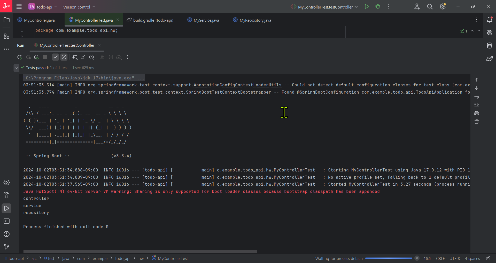

<3주차 스터디 정리>

1. 스프링 빈(Spring Bean)과 컨테이너(Application Context)

스프링 빈: 애플리케이션 전역에서 공용으로 사용하는 객체를 의미하며, 스프링 컨테이너에서 관리된다. 빈은 객체를 필요로 하는 클래스에 의존성 주입을 통해 제공된다.
스프링 컨테이너: 빈을 저장하고 관리하는 공간. ApplicationContext로도 불리며, 빈을 등록하고 요청에 따라 빈을 제공한다. 스프링 컨테이너는 빈을 생성하고 의존성을 자동으로 주입해준다.
스프링 부트: 스프링 프레임워크 위에 구축된 도구로, 스프링 애플리케이션을 더 쉽게 만들 수 있도록 돕는다.

2. 스프링 빈을 등록하는 방법

수동 등록 (설정 파일 작성): 빈을 명시적으로 정의하는 방식.
클래스에 @Configuration 어노테이션을 붙여 설정 파일임을 명시하고, 메서드에 @Bean 어노테이션을 붙여 빈을 등록한다.
예시: 설정 파일에서 빈을 정의하고, 테스트에서 ApplicationContext를 통해 빈을 가져와 사용한다.
자동 등록 (컴포넌트 스캔): @Component 어노테이션을 클래스에 붙여 자동으로 빈을 등록하는 방식.
@ComponentScan 어노테이션을 사용해 스캔 범위를 지정하면, 해당 범위 내의 모든 @Component가 붙은 클래스들이 자동으로 빈으로 등록된다.

3. 의존성 주입 (Dependency Injection, DI)

의존성 주입은 객체의 의존성을 스프링 컨테이너가 자동으로 주입해주는 방식이다.
의존성 주입의 세 가지 방법:
생성자 주입: 의존성이 변하지 않는 경우 사용. @Autowired를 통해 생성자에서 의존성을 주입할 수 있으며, 생성자가 하나뿐인 경우에는 @Autowired를 생략할 수 있다. @RequiredArgsConstructor를 사용해 final 필드에 대한 생성자를 자동으로 생성할 수 있다.
필드 주입: @Autowired를 필드에 직접 붙여 빈을 주입하는 방식. 주로 테스트 코드에서 사용되며, 운영 코드에서는 권장되지 않는다.
세터 주입: 메서드를 통해 주입하는 방식으로, 필요한 경우만 의존성을 주입할 때 사용한다.

4. 의존성 주입의 이유

OCP (Open-Closed Principle): 객체지향 원칙을 준수하여 코드의 변경 없이 확장이 가능하다.
객체를 매번 생성하지 않고, 이미 생성된 객체를 재사용하므로 메모리 효율성을 높일 수 있다.

5. 스프링의 계층 구조 (Layered Architecture)

Controller (컨트롤러): 클라이언트의 요청을 받고, 요청에 대한 응답을 생성하는 계층. DTO(Data Transfer Object)를 사용해 데이터를 서비스 계층과 주고받는다.
Service (서비스): 비즈니스 로직이 처리되는 계층으로, 데이터를 처리하거나 로직을 결정하는 역할을 한다.
Repository (레포지토리): DB와 소통하는 계층으로, 데이터를 저장, 조회, 삭제, 수정하는 작업을 담당한다.

<테스트 실행 결과>
